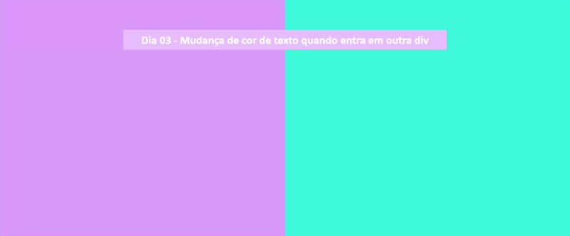

# Dia 03 - Mudança de cor de texto quando entra em outra div

- [Projeto no CodePen]()

## Tecnologias usadas

- HTML
- CSS

## O que aprendi

- [CSS white-space](https://www.w3schools.com/cssref/pr_text_white-space.asp)
- [CSS position](https://www.w3schools.com/css/css_positioning.asp)
- [CSS overflow](https://www.w3schools.com/css/css_overflow.asp)
- [CSS z-index](https://www.w3schools.com/cssref/pr_pos_z-index.asp)