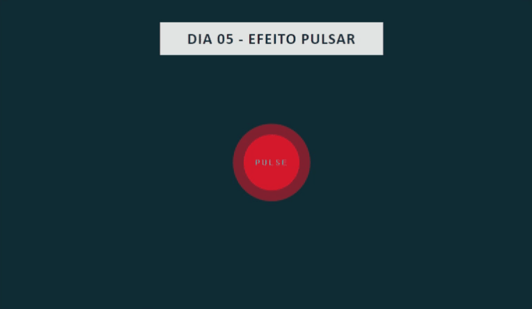

# Dia 05 - Efeito pulsar

- [Projeto no CodePen](https://codepen.io/plgisele/pen/QWdJyNV)

## Tecnologias usadas

- HTML
- CSS

## O que aprendi

- [CSS box-shadow](https://www.w3schools.com/cssref/css3_pr_box-shadow.asp)
- [CSS rgba()](https://www.w3schools.com/cssref/func_rgba.asp)